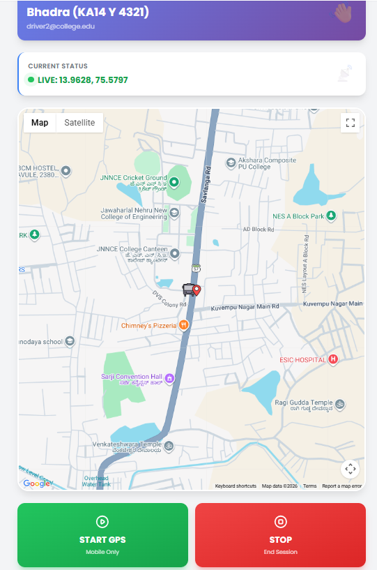
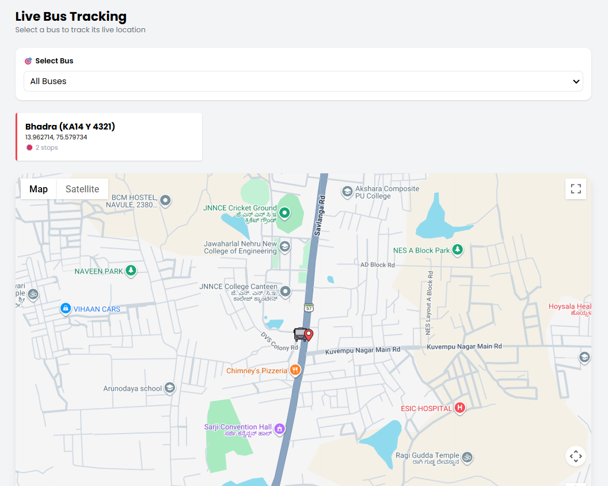
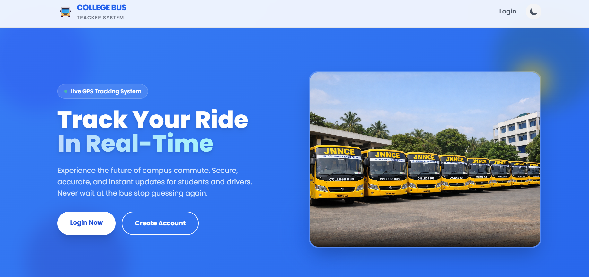

# College Bus Tracking System

A real-time web-based system to track college buses using GPS and live updates.

## Features
- Live bus tracking
- Real-time updates using Socket.IO
- Driver and Student modules
- Interactive map using Google Maps API

## Technologies Used
- Node.js
- Express.js
- Socket.IO
- HTML, CSS, JavaScript

## How to Run
1. Install dependencies:
   npm install

2. Start server:
   node server.js

3. Open browser:
   http://localhost:3000
## Screenshots

### Driver Dashboard

### Student Dashboard

### Home Page

